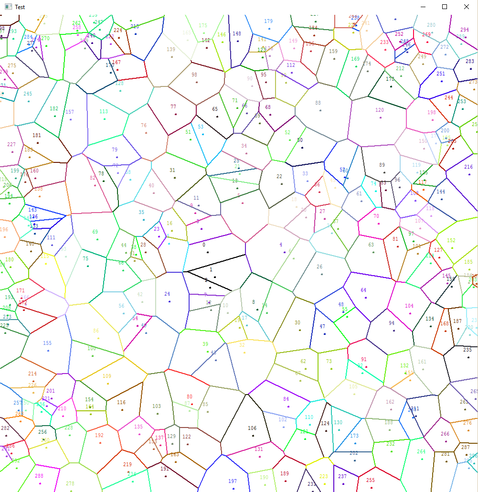

Ce projet correspond au TER (Travail d’Étude et de Recherche) de deuxième année de licence : implémentation en C de la construction du diagramme de Voronoi via l’algorithme de Green–Sibson. L’affichage est réalisé avec ez-draw.